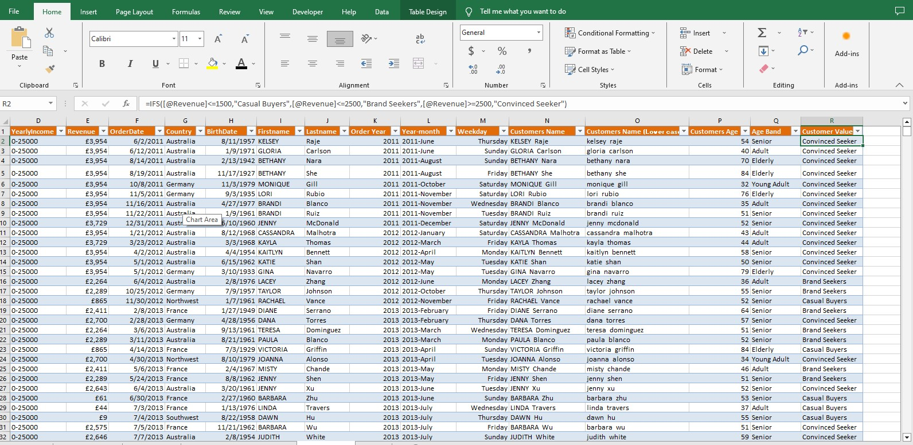
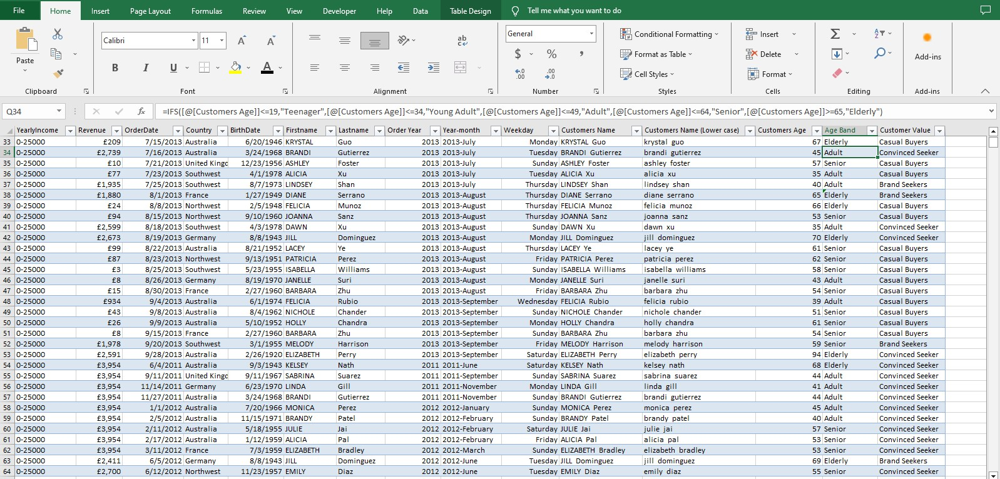
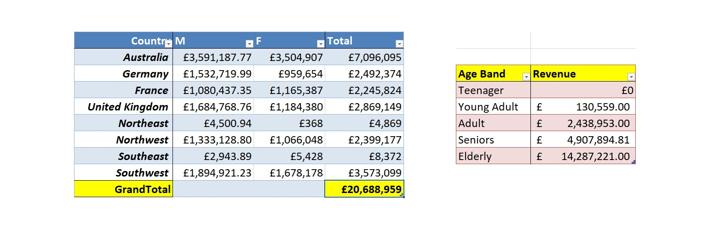
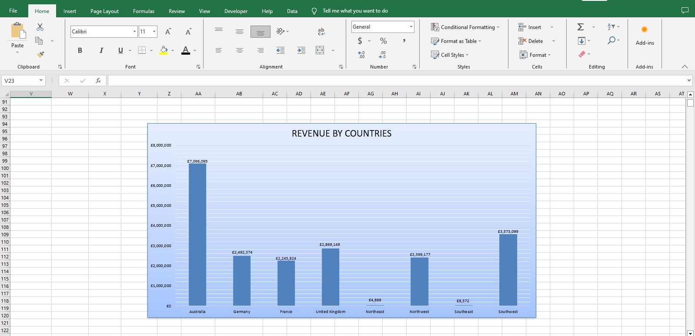
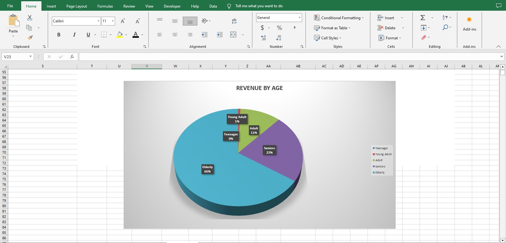
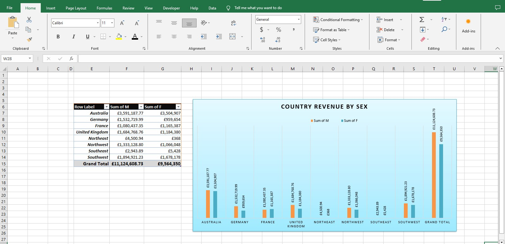

# Sales-Performance-Analysis
This is a project that shows my ability to query data from Adventure work DW database and analyze with Excel.

## Introduction
This is an analysis of the Sales performance of an Adventure works DW. it is done by analyzing data from Adventure work Database. I analyzed data from customers ID, Gender, Marital-Status, Yearly-income, Revenue, Order-Date, Country, Birthdate,Customers name, Customers Age, Ageband, Customer Value. I used Microsoft Excel to analyze the data from the dataset.

*Disclaimer:* This is not a real company as we know that Adventure works DW database is compiled by Microsoft for learning purposes.

## Problem Statement
- Determine the current market demand for products and how it varies by region/location
- Know the current sales performance and how it compares to past performance and industry benchmarks
- Identify the areas where sales performance is lacking or could improved
- To discover target markets or goods that have the greatest impact on sales success.
- Finally, the goal is to create data-driven plans that can aid in increasing sales, improving customers happiness, and driving corporate growth.

## Skills and Concept Demonsrated
 Microsoft Excel concept like:
-  creating colums for calculations for Order Year, Year-month, Weekday, Customers Name, Age, Age band, Customer value
-  Data Visulization

## Data Collection
Getting a structured data of the Adventure work wasn’t difficult cause I had the privilege of downloading the excel format, which made my work a lot easier

## Data Cleaning and Preparation
After getting the Excel dataset ready, I had to format and clean the data set by removing duplicates and to make sure there are no empty cells and stuffs that will lead to a biased analysis. Also to enable filtering the data set.

The following steps where done is cleaning the file: • Borders were put on the document. Font style was changed to suit the taste of the Analyst. I also made sure my dataset was in a table to enable better visualization

## Data Anaylsis and Visualization
The dataset was analyzed using Excel table. Below is the dashboard that gives an Anaylitical report on the sum of revenue by Country, Gender and Age band.

Below is the dashboard that gives a visualization of Revenue by Country using charts

Below is the dashboard that gives a visualization of Revenue by Age using charts

Below is the dashboard that gives a visualization of Revenue generated by Male and Female in each country

## Result
-  The total Sales by customers was (Euros 20.688m)
-  Australia had the highest sales with their Male customers made orders of about (Euros 3.591m) and Female customers made orders of about (Euros 3.504m). followed by Southwest which the male customers made orders of 
   about (Euros 1.894m) and the female customers made orders of about.
-  The Elderly made the highest sales of about (Euros 14.287m) followed by the Senior citizens which made about (Euros 4.907m). The Teenager had no sales in the category.

## Recommendation
There are no doubts that the Business is performing well as the major customers where are from Australia.
However, there is room for more improvements
-  The Teenager didn’t do any sales. Strategies to increase the sales should be made like High publicity, discounted selling on products
-  Use database to gather customers feedback to get their experiences about the product or services. This information can be used to identify areas for improvement.

